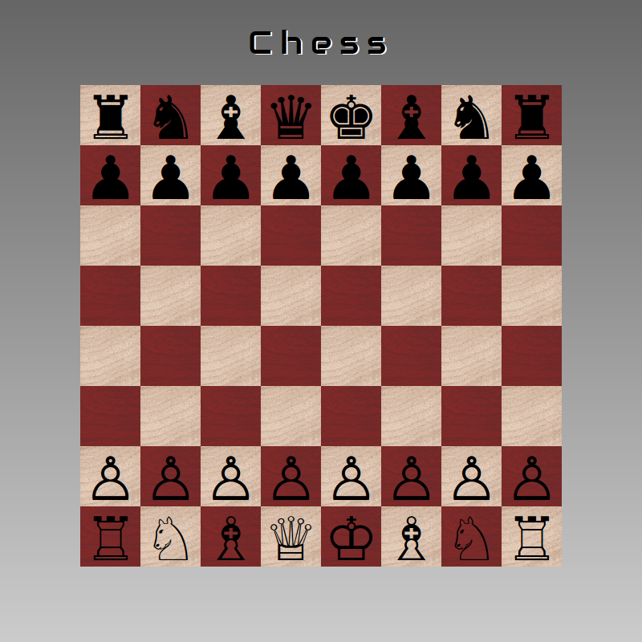

Chess
=====

## Screenshot

## Links

♞ [GNU Chess][3]

## Libraries
* [jQuery][4]
* [normalize.css][5]

## Fonts

* __[Ubuntu Mono][6]__
* __Audiowide__ _Copyright (c) 2012, [Brian J. Bonislawsky DBA Astigmatic][7] (AOETI)_

## Creator

**Stefan Hüsges**

:computer: [Homepage][1]

:octocat: [GitHub][2]

## License

[MIT License](LICENSE)

[1]: http://www.mpcx.net
[2]: https://github.com/tronsha
[3]: http://www.gnu.org/software/chess/
[4]: http://jquery.com/
[5]: http://necolas.github.io/normalize.css/
[6]: http://font.ubuntu.com/
[7]: mailto:astigma@astigmatic.com
